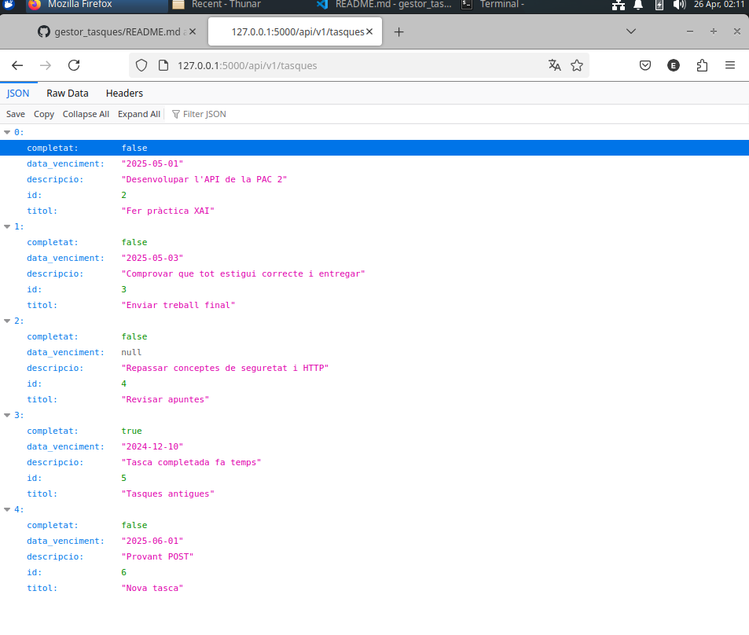

# Gestor de Tasques (To-Do List API)

API REST creada amb Flask i PostgreSQL per gestionar tasques.

## Funcionalitats
- Crear una tasca
- Llistar totes les tasques
- Consultar una tasca per ID
- Actualitzar una tasca
- Eliminar una tasca

## Requisits
- Python 3.8 o superior
- PostgreSQL

## Instal·lació
1. Clona el repositori:
   ```bash
   git clone https://github.com/Evilamajor/gestor_tasques.git
   cd gestor_tasques
## Exemple de funcionament



## Exemples d'ús

### Consultar totes les tasques
```bash
curl http://127.0.0.1:5000/api/v1/tasques

### Crear una nova tasca

curl -X POST http://127.0.0.1:5000/api/v1/tasques \
-H "Content-Type: application/json" \
-d '{"titol":"Estudiar API REST","descripcio":"Revisar codi","data_venciment":"2025-05-10","completat":false}'

### Actualitzar una tasca

curl -X PUT http://127.0.0.1:5000/api/v1/tasques/1 \
-H "Content-Type: application/json" \
-d '{"titol":"API REST actualitzada","descripcio":"Millores finals","data_venciment":"2025-06-01","completat":true}'


### Esborrar una tasca

curl -X DELETE http://127.0.0.1:5000/api/v1/tasques/1


